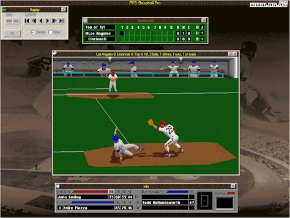
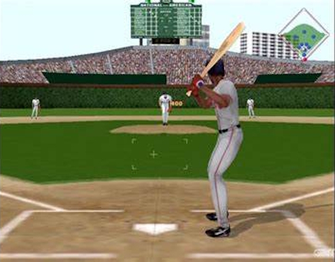
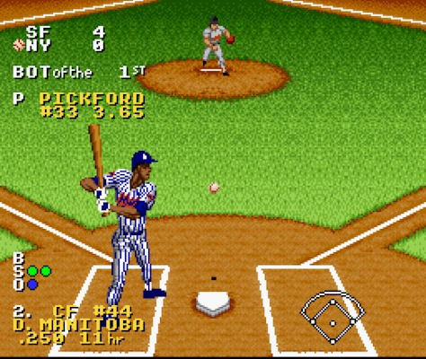

===============================
INTRODUCTION
===============================
OpenBaseball is primarily intended as a personal hobby proejct to help me practice and hone varying programming skills that I would either like to polish or learn for the first time, including:

1. GUI programming
#. Video game engine development
#. Desktop event handling
#. Multi-window application development

This document is intended as a living document and will grow and evolve over time as additional thought and consideration is put into the design direction of OpenBaseball.

If you are interested in collaborating on this project, please see the README.md for details on getting in contact.

===============================
PROJECT GOALS
===============================
The primary goal of OpenBaseball is to produce a game that recreates the general look and feel of the baseball games common during the mid-1990s to early 2000s but updated where appropriate for use on modern hardware and suitable for modern sensibilities.  OpenBaseball will use Front Page Sports: Baseball '98 and Microsoft Baseball 200 as a core inspiration and then expand on it (to varying degrees) into adjacent gameplay mechanisms or depth of technical detail.

===============================
STYLE & AESTHETICS
===============================

******************************
Presentation & User Interface
******************************
The User Experience (UX) and User Interface (UI) of Front Page Sports: Baseball is a key influence - particularly the multi-window based experience.

******************************
Art Style
******************************
The overarching art style of OpenBaseball will be respectful of the sport (eg, avoid cartoon style graphics) without being hyper-realistic.  A good example of the general aesthetic is Microsoft Baseball 2000:

That is, player models should have realistic proportions and movements.

The game should **explicitly** *avoid* cartoon style art with exagerated features or movements.  As noted, an example of the art style to avoid is Ken Griffey Jr MVP Baseball:

******************************
Graphics Rendering
******************************
The graphics of OpenBaseball will be entirely rendered in 3D for the primary game window (the window where the on-field action is portrayed).  As noted, OpenBaseball will have a User Experience that is based around a multi-window User Interface.  All of the secondary windows will utilize text and 2D graphics to present statistics and information about the game to the player.

===============================
GAMEPLAY MODES
===============================
OpenBaseball will provide several different play modes.  From a data perspective, the baseline simulation of the events in the game should still derive from the same source data, such as:

1. Player health (illness, age, ability, etc)
#. Player statistics
#. Time of day
#. Weather
#. Altitude
#. Field conditions

The only difference in the various modes is the level of granular detail that is presented to the player and how much of it needs to be *actively* acted upon in order to move the game forward.

For example, a player who is engaged in Exhibition mode will likely be primarily focused on interacting with pitch selection, fielding the ball, and batting.  Conversely, this player is likely not as interested in managing the details of player injuries, salaries, trades, etc.  A player *may* want to be involved in these details and the game should *allow* the player to be involved in these details but it must not *require* a casual player to manage these details in order to complete a session of Exhibition mode.

******************************
Exhibition Mode
******************************
This mode is expected to be the primary game loop for most players.  This game mode will serve as the "engine" for experiencing both one-off "exhibition" games as well as regular season games when managing a team in the Regular Season mode.

This mode will allow the player to manage all aspects of the game, including:

1. Roster selection
#. Starting line-up selection
#. Batting order
#. Player substitution
#. Pitch selection
#. Pitch location
#. Pitch Speed
#. Hitter position
#. Hitter swing
#. Fielder position
#. Fielding the ball

Additionally, this mode will allow the user to select the following parameters about the game in general when presenting an exhibition game:

1. The competing teams
#. Time of day
#. Weather conditions
#. Stadium (including a stadium not associated with either competing team)
#. Home/visitor status of each team

A special variant of this mode will be the "All Star" game which will allow for the selection of the players from all teams present in the currently selected league.

******************************
Regular Season
******************************
This mode allows the user to select a team and then proceed to play all of the games in a regular season.  When simulating a given game, the player will have the option to play the game manually using the "Exhibition Game" mode experience described above or have the computer simulate the game automatically based on the statistics of the current player / league database and a probability model.

******************************
Home Run Derby
******************************
This mode replicates the rules and experience of a home run derby event.  It is *NOT* a complete game experience and the rules of the home run derby are entirely unique as compared to a regular game.

This mode will be entirely a hitting experience and will provide automated pitching.  The pitching in this mode is not intended to be "competitive." Instead, the pitching in this mode should largely provide "consistent" position and speed of the ball when delivered to the hitter.  For the sake of realism, this mode should provide some standard deviance from pitch to pitch.

******************************
Manager Simulation
******************************
The Manager Simulation mode should allow the player to focus their intention on a subset of tasks normally present in a game.  Rather than managing the individual selections for pitching, hitting, and fielding the Manager Simulation mode should allow the player to focus their intention on the larger "narrative" of the game and focus on player selection during the starting lineups and player substitutions during the simulation of a given game.  The actions of the players should be performed autoamtically based on the individual statistics of the teams & players and the simulation model which should include all of the atmospheric and weather parameters for the stadium in which the game is being played.

******************************
Owner Simulation
******************************
The Owner Simulation mode should be a superset of the Manager Simulation mode with additional statistics and metrics presented (and actionable) such as:

1. Player salary
#. Manager & staff salaries
#. Manager & staff performance (eg, Win/Loss ration, etc)
#. Inter-team trades
#. Ticket sales
#. Team revenue

Importantly, unlike Manager Simulation mode, the Owner Simulation mode allows the player to change the structure of the staff and players on the team.

===============================
GAME MECHANICS
===============================

******************************
Simulation Engine
******************************

******************************
Player Performance
******************************

******************************
Player Health
******************************

******************************
Atmosphere & Weather
******************************

The weather of a game should be based on the typical weather found in the geography of the chosen home stadium and the time of year when the game is to be player.  For additional realism, the player should have the option to have OpenBaseball fetch the current (or historical) real-world weather for the location.

Atmospherically, the game should model and account for the altitude (including relative humidity and air density of the home stadium.  The player should be able to notice a realistic change in performance (for players as well as the ball) when playing at sea level versus playing at higher altitudes.

===============================
UPDATES, EXTENSIONS, & MODDING
===============================

******************************
Deploying Updates
******************************

******************************
Updating Game Data
******************************

******************************
Modding & Extending the Game
******************************
